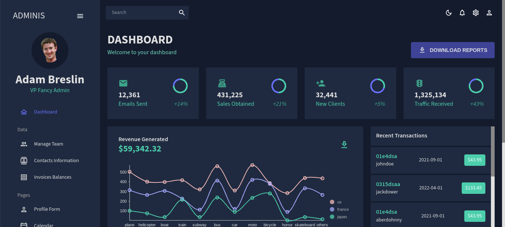

# React Admin Dashboard
=========================================

React Admin Dashboard App | React, MUI, Data Grid, Light & Dark Mode

I also added a lot of other dependencies like formik, yup, and nivo charts. This is a professional react admin dashboard that I made.

# Links
=========================================
[MUI](https://mui.com/)
[Nivo Charts](https://nivo.rocks/components/)
[Formik](https://formik.org/docs/overview#installation)
[Yup Validation](https://github.com/jquense/yup)